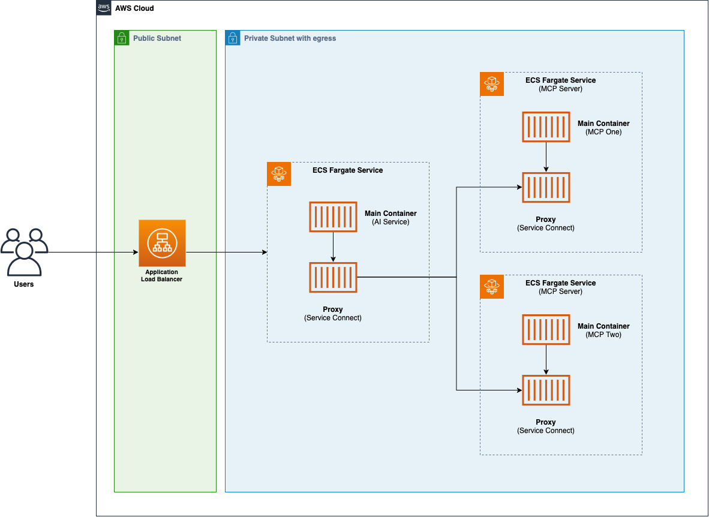

# ECS MCP Server Sample

The following sample demonstrates how to deploy an Agentic AI architecture using AWS Fargate for Amazon ECS. It uses [AWS CDK](https://github.com/aws/aws-cdk) to deploy the architecture components.

## High Level Architecture



## Details

The architecture consists of the following components:

- **Application Load Balancer**: takes incoming API calls and forwards them to the AI Service
- **AI Service**: Simple AI Agent that connects with two MCP servers to perform actions
- **MCP Server one**: Custom built MCP Server using the [MCP Python SDK](https://github.com/modelcontextprotocol/python-sdk). In this example the MCP Server implements [math tools](./services/mcp-one/index.py)
- **MCP Server two**: It hosts an existing MCP Server ([AWS API MCP Server](https://github.com/awslabs/mcp/tree/main/src/aws-api-mcp-server)). For the sake of this example this MCP Server's role has been restricted to only be able to list AWS Buckets in your account

Service-to-service communication between AWS Fargate services is done using [Service Connect](https://docs.aws.amazon.com/AmazonECS/latest/developerguide/service-connect.html). The **AI Service** leverages custom DNS names to connect to the MCP Servers available in this sample.

The sample also generates an AWS Secret to be used as the `x-api-key` header when calling the Application Load Balancer URLs.

## Prerequisites

- [Node.js](https://nodejs.org/en/download/) installed in your local machine (version >= 20)
- [Docker](https://www.docker.com/products/docker-desktop/) installed in your machine
- [AWS CLI](https://docs.aws.amazon.com/cli/latest/userguide/getting-started-install.html) configured in your local machine
- [Bedrock Model Access](https://docs.aws.amazon.com/bedrock/latest/userguide/model-access-modify.html) to Anthropic Claude Sonnet 4 configured in your account

## Getting started

To deploy this sample in your account follow the instructions below:

```bash
# install dependencies
$ npm install
# login to the public ECR registry to allow download base images
$ aws ecr-public get-login-password --region us-east-1 | docker login --username AWS --password-stdin public.ecr.aws
# bootstrap your AWS environment (in case you haven't done it yet)
$ npm run cdk bootstrap
# deploy the CDK Stack into your account
$ npm run cdk deploy
```

## Testing

Once the deployment is finalized in your account, you will have the following output from AWS CDK:

```bash
 ✅  EcsMcpServerSampleStack

✨  Deployment time: 362.32s

Outputs:
EcsMcpServerSampleStack.ALBLoadBalancerDNS6ED38D87 = [application-load-balancer-url]
EcsMcpServerSampleStack.AiServiceSecretARN2FB050DB = [secret-arn]
```

Before invoking the Application Load Balancer URL, you'll need to retrieve the secret value with the following command:

```bash
$ aws secretsmanager get-secret-value --secret-id [secret-arn]
# or use the following to directly get the value
$ aws secretsmanager get-secret-value --secret-id [secret-arn] --output json | jq -r '.SecretString'
```

Now that you have all the information, you can call the Application Load Balancer URL to test the agent:

```bash
curl --location 'http://[ALB-URL]/chat' \
--header 'x-api-key: [secret-value]' \
--header 'Content-Type: application/json' \
--data '{
    "prompt": "what'\''s the command to list AWS Buckets"
}'
```

````json
{
  "answer": "The command to list AWS S3 buckets is:\n\n```bash\naws s3 ls\n```\n\nThis command will display all S3 buckets in your AWS account, showing:\n- Creation date and time\n- Bucket name\n\nAs you can see from the output, it lists all the buckets with their creation timestamps and names. The command works across all regions and shows buckets from your entire AWS account.\n"
}
````

or execute the AWS CLI command:

```bash
curl --location 'http://[ALB-URL]/chat' \
--header 'x-api-key: [secret-value]' \
--header 'Content-Type: application/json' \
--data '{
    "prompt": "list all my AWS Buckets"
}'
```

```json
{
  "answer": "Here are all your S3 buckets: [omissis]"
}
```

or compute some math using the [custom MCP Server](./services/mcp-one/index.py):

```bash
curl --location 'http://[ALB-URL]/chat' \
--header 'x-api-key: [secret-value]' \
--header 'Content-Type: application/json' \
--data '{
    "prompt": "what'\''s 2+2"
}'
```

```json
{
  "answer": "2 + 2 = **4**\n"
}
```

## Security

See [CONTRIBUTING](CONTRIBUTING.md#security-issue-notifications) for more information.

## License

This library is licensed under the MIT-0 License. See the LICENSE file.
